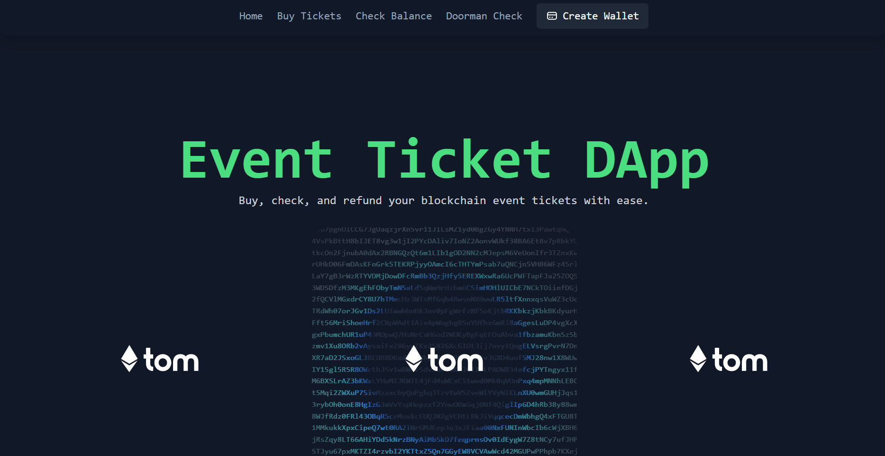
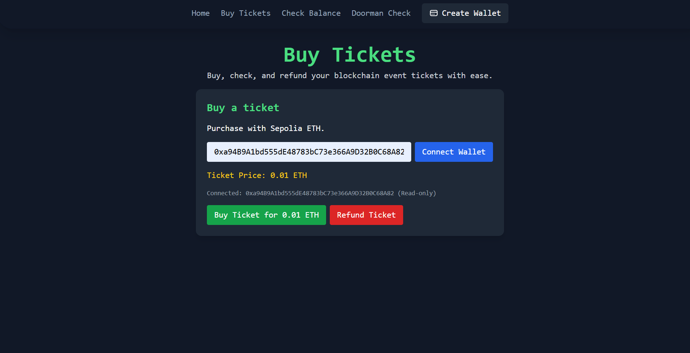
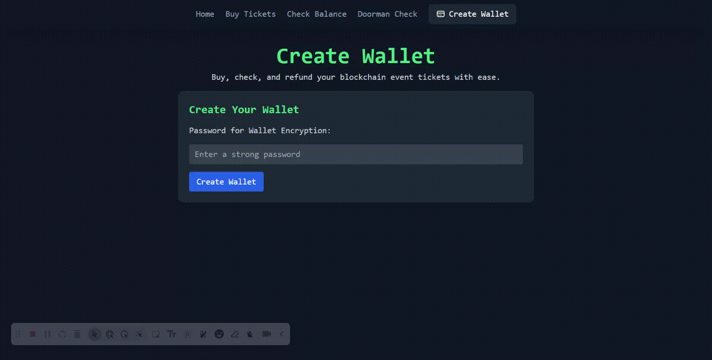

# Blockchain Event Ticketing DApp

This project is a decentralized application (DApp) for blockchain-based event ticketing. It allows users to create wallets, purchase event tickets, check balances, validate tickets, and request refunds, all through a modern, unified web interface. The backend is powered by Ethereum smart contracts, and the frontend is built with HTML, Tailwind CSS, and JavaScript (ethers.js).



## Features

- **Wallet Creation:** Users can generate a new Ethereum wallet directly in the browser and download the private key for safekeeping.
- **Ticket Purchase:** Buy event tickets using Sepolia ETH. Each ticket is represented as an ERC20 token on the blockchain.
- **Refunds:** Users can refund their tickets at any time (as long as they own a ticket and the contract has funds).
- **Balance Check:** Check ETH and ticket token balances for any wallet address.
- **Doorman Check:** Validate tickets for event entry.
- **Vendor Withdrawal:** Event vendors can withdraw accumulated funds from ticket sales.
- **Modern UI/UX:** All pages share a consistent, modern design with interactive card effects and a unified navigation header.



## Smart Contract

- **File:** `contracts/accessToken.sol`
- **Token:** ERC20-compliant, named `EventTicket (ETIX)`
- **Key Functions:**
  - `buyTicket()`: Purchase a ticket with ETH.
  - `refundTicket()`: Refund a ticket (no time limit).
  - `withdrawFunds()`: Vendor withdraws accumulated ETH.
- **No Refund Window:** Refunds are always allowed if the user owns a ticket and the contract has funds.

## Frontend

- **Location:** `frontend/`
- **Main Pages:**
  - `homepage.html`: Landing page and quick ticket purchase.
  - `ticketPurchase.html`: Buy or refund tickets.
  - `balanceCheck.html`: Check wallet and ticket balances.
  - `checkTicket.html`: Validate tickets for entry.
  - `walletCreation.html`: Create and download a new wallet.
  - `vendorPage.html`: Vendor withdrawal panel.
- **Shared Components:**
  - `header.html` and `header-component.js`: Consistent navigation/header across all pages.
  - `main.js`: Handles wallet connection, ticket purchase/refund, and card UI effects.
  - `config.js`: Stores contract addresses and network configuration.
  - `css/style.css`: Custom styles and card effects.

## How to Deploy and Use

### 1. Install Dependencies

```
npm install
```

### 2. Compile Contracts

```
npx hardhat compile
```

### 3. Deploy Contract

- Configure your `.env` file with your wallet's private key, Sepolia RPC URL, and vendor address.
- Deploy to Sepolia:

```
npx hardhat run scripts/deploy.js --network sepolia
```

- Copy the deployed contract address and update `frontend/config.js`.

### 4. Run the Frontend

- Open any HTML file in the `frontend/` folder in your browser (e.g., `homepage.html`).
- Make sure you are connected to the Sepolia network in MetaMask.

## Development Notes

- The DApp uses ethers.js for blockchain interactions.
- All ticket and refund logic is handled on-chain for transparency and security.
- The refund window has been removed; refunds are always available if the user owns a ticket.
